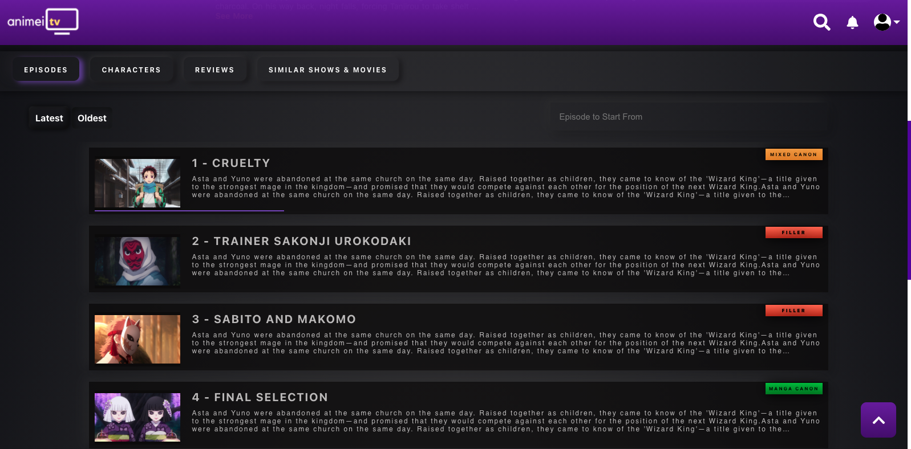
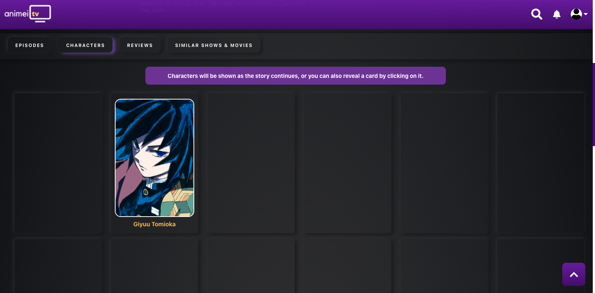
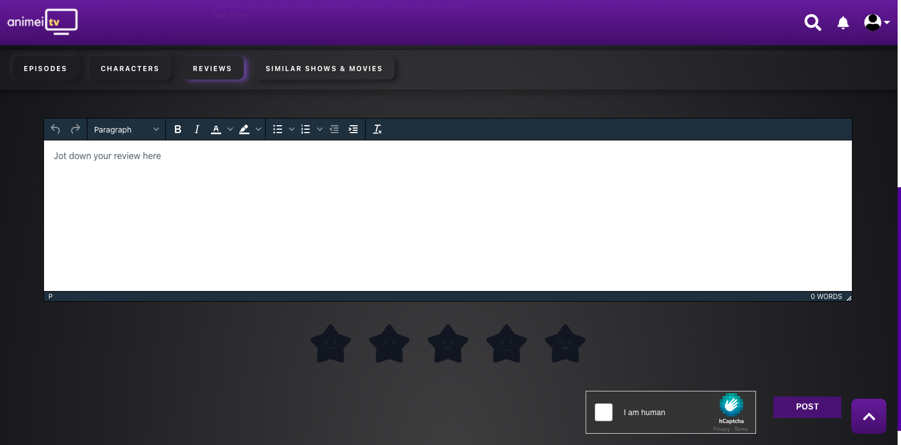
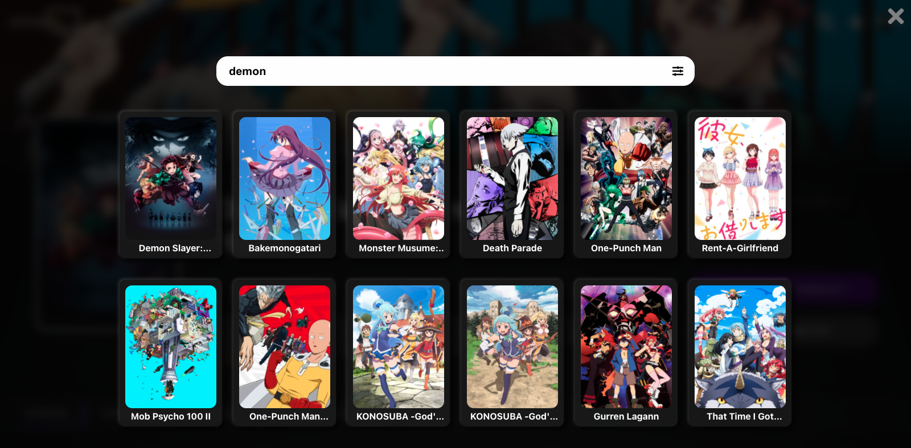
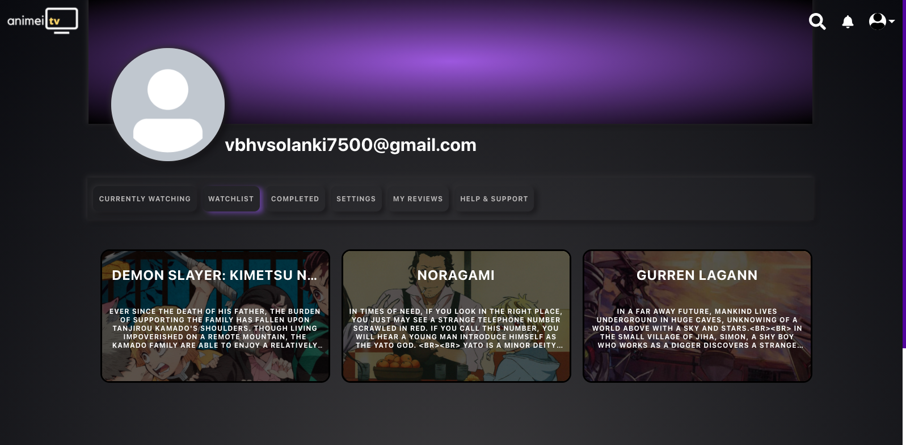
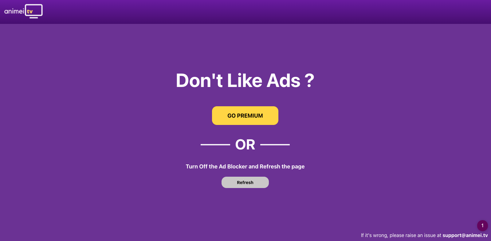

<h1 align='center'>
  Animei TV
</h1>

<p align='center'>
  Animei TV is a full fledged working OTT Platform.


</p>

# Demo

URL: https://anime-web-app.herokuapp.com/

Email: test@test.com
    
Password: Hello@123

# [Screenshots](#screenshots)

# Installation

## Requirements

* Yarn - Setup yarn from [here](https://classic.yarnpkg.com/en/docs/install/#windows-stable)

* Node - Setup Node from [here](https://docs.npmjs.com/downloading-and-installing-node-js-and-npm)

* Self Signed SSL - [here](https://zeropointdevelopment.com/how-to-get-https-working-in-windows-10-localhost-dev-environment/)

* Redis - [here](https://linuxize.com/post/how-to-install-and-configure-redis-on-ubuntu-18-04/)

## Backend:
* Install packages required.

    ```
    cd backend
    npm install
    ```
* Check for MySQL
    ```
    which mysqld
    ```
    If it shows the path then continue otherwise install MySQL.
* Create a config folder and copy config files in that folder

* Create a certificate folder and copy the self signed certificate over there.

* Create Database
    ```
    npm run db
    ```

* Crate a .env file and copy the required content.
* Start Server
    ```
    npm run dev
    ```

## Frontend
* Install packages required.
    ```
    cd frontend
    npm install
    yarn install
    ```

## How to Run
* In terminal 1
```
cd backend
npm run dev
```
* In terminal 2
```
cd frontend
npm start
```
<strong>Note</strong> : We consider you are at the root folder of the app in both the terminals.


## How to Build
* In root folder run
    ```
    sh .\build.sh
    ```

<span name="screenshots"></span>
# Images

### Show Page


### Episodes


### Characters


### Review


### Search


### Profile


### Player


### Ad Blocked
