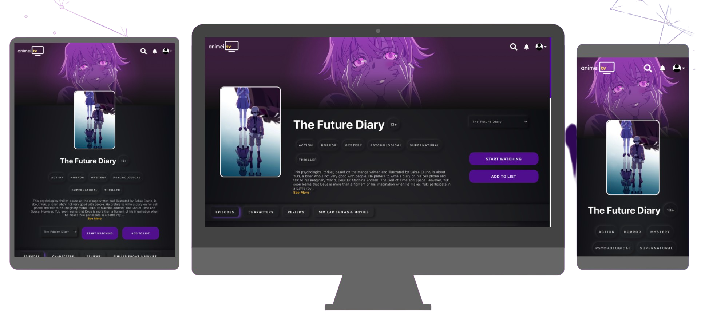

<h1 align='center'>
  Animei TV
</h1>

<p align='center'>
  Animei TV is a full fledged working OTT Platform.


</p>

# Test Account

Email: test@test.com
    
Password: Hello@123

# [Screenshots](#screenshots)


## Quick Demo

Requirements: Docker & Docker Compose

```

sh setup.sh && sh start.sh
```

# Development

## Requirements

* Yarn - Setup yarn from [here](https://classic.yarnpkg.com/en/docs/install/#windows-stable)

* Node - Setup Node from [here](https://docs.npmjs.com/downloading-and-installing-node-js-and-npm)


## Backend:
* Install packages required.

    ```
    cd backend
    npm install
    ```

* Crate a .env file and copy the required content.
* Start Server
    ```
    npm run dev
    ```

## Frontend
* Install packages required.
    ```
    cd frontend
    npm install
    yarn install
    ```

## How to Run
* In terminal 1
```
cd backend
npm run dev
```
* In terminal 2
```
cd frontend
npm start
```
<strong>Note</strong> : We consider you are at the root folder of the app in both the terminals.


## How to Build
* In root folder run
    ```
    sh .\build.sh
    ```

<span name="screenshots"></span>
# Images

### Landing Page

### Show Page


### Episodes


### Characters


### Review


### Search


### Profile


### Player


### Ad Blocked
